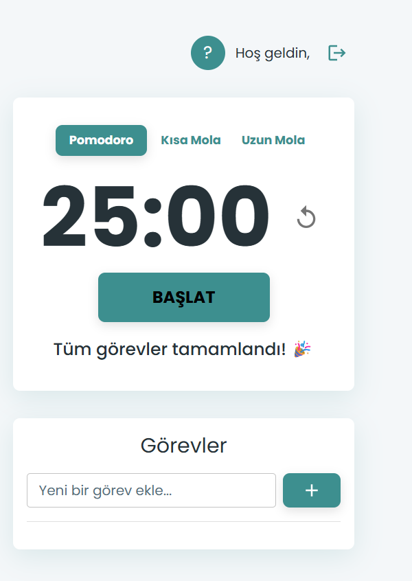

# Focus App - A Full-Stack Pomodoro Tracker

This is a modern, full-stack Pomodoro timer and task management application built with **React** and **Django**. It features a complete user authentication system (register/login) using JWT and allows users to manage their tasks, with all data persistently stored in a PostgreSQL database.

## ✨ Live Demo (Optional)

> This section can be filled out after deploying the project to a platform like Vercel or Netlify.
> e.g., `[focus-app.vercel.app](https://focus-app.vercel.app)`

## 📸 Screenshots

| Main Application View |
|  | 
> *Make sure to add your screenshots to a `screenshots` folder in the root directory.*

## 🚀 Features

- **Pomodoro Timer:** Adjustable sessions for Pomodoro (25 min), Short Break (5 min), and Long Break (15 min).
- **Task Management:** User-specific to-do lists with full CRUD (Create, Read, Update, Delete) functionality.
- **User Authentication:** Secure user registration and login system based on JSON Web Tokens (JWT).
- **Persistent Data:** All tasks are stored in a database, scoped to the authenticated user.
- **Modern UI:** A sleek, responsive, and user-friendly interface designed with Material-UI (MUI).
- **Decoupled Architecture:** A clear separation between the React frontend and the Django (Python) backend, allowing for independent development and deployment.

## 🛠️ Tech Stack

**Frontend:**
- React (with Vite)
- TypeScript
- Material-UI (MUI)
- Axios (for API requests)
- jwt-decode

**Backend:**
- Python
- Django & Django Rest Framework
- Simple JWT (for authentication)
- PostgreSQL (run with Docker)
- Corsheaders

**Development Tools:**
- Docker
- VS Code
- Thunder Client (for API Testing)
- Git & GitHub

## 🏃‍♀️ Getting Started / Local Setup

Follow these steps to run the project on your local machine.

### Prerequisites
- Node.js (LTS version recommended)
- Python 3.x
- Docker Desktop

### Installation & Setup

1.  **Clone the Repository:**
    ```bash
    git clone https://github.com/havvakrbck1/focus-app.git
    cd focus-app
    ```

2.  **Setup and Run the Backend:**
    ```bash
    # Navigate to the backend directory
    cd django_server

    # Create and activate a virtual environment
    python -m venv venv
    .\venv\Scripts\activate

    # Install Python packages
    pip install django djangorestframework django-cors-headers djangorestframework-simplejwt

    # Start the PostgreSQL database container
    docker run --name focus-app-postgres -e POSTGRES_PASSWORD=12345 -p 5432:5432 -d postgres

    # Apply database migrations
    python manage.py migrate

    # Start the backend server
    python manage.py runserver
    ```
    > The backend will be running at `http://localhost:8000`.

3.  **Setup and Run the Frontend (in a new terminal):**
    ```bash
    # Navigate back to the root project directory
    cd ..

    # Install Node.js packages
    npm install

    # Start the frontend development server
    npm run dev
    ```
    > The frontend will be running at `http://localhost:5173`.

---